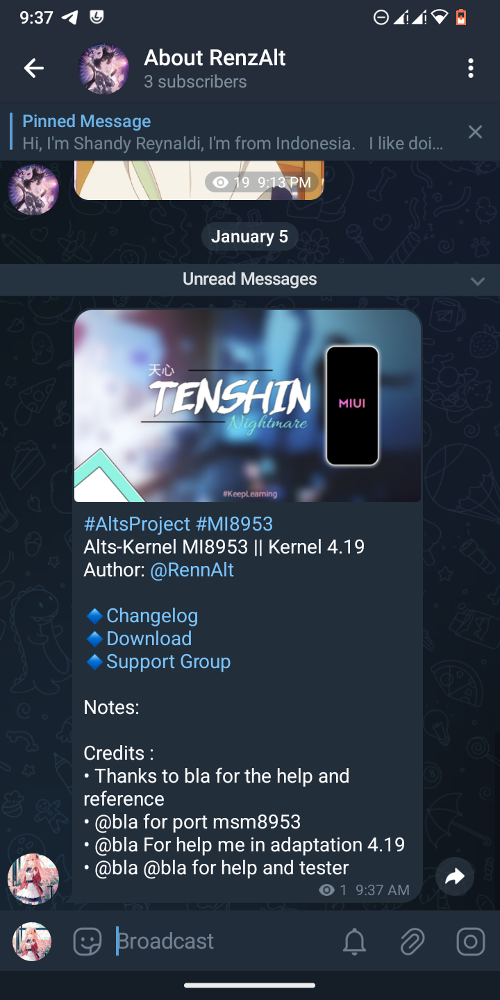
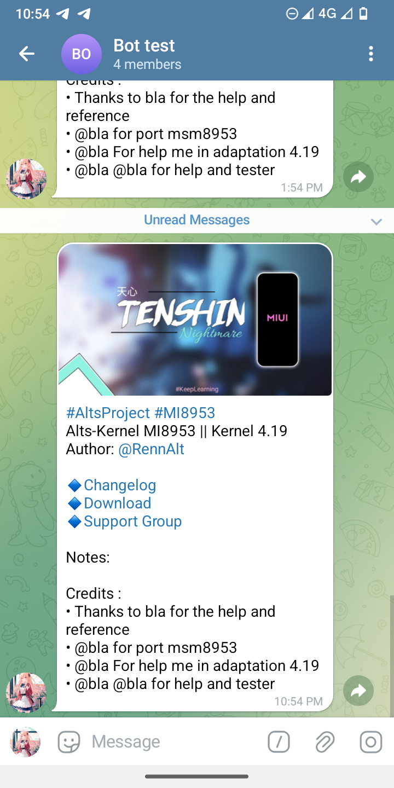
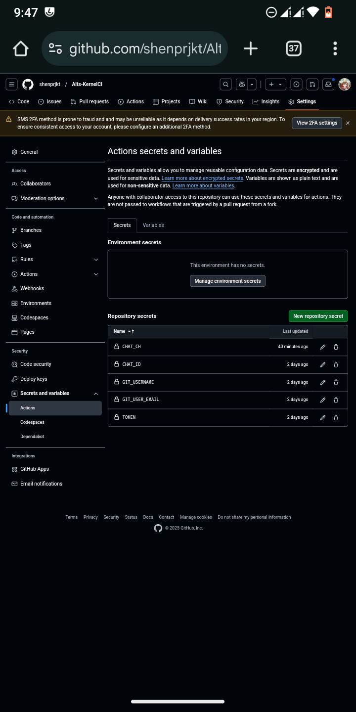
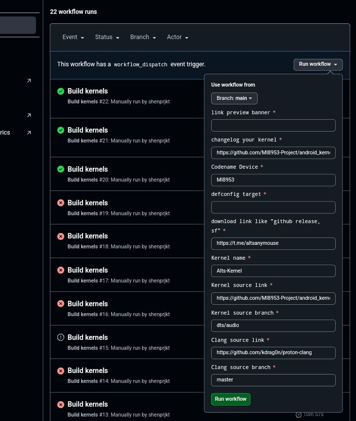

<h1>Build Your Kernel with Github Action</h1>

 

This Github Action helps you build kernels. It reads multiple kernel sources from a configuration file and builds them using different toolchains. Additionally, it supports patching the kernel with KernelSU and uploading the built kernel image.
 

---

**[<kbd>    Configure    </kbd>](#configuration)**
**[<kbd>    Quick Start    </kbd>](##how-to-use)**
**[<kbd>    Local testing    </kbd>](##local-testing)**

---

# Github Action

This action contains three jobs: `Setup-Env`, `Build-Kernel`, `Post-Update`.

`Setup-Env` stage is the Dependency Installation stage.

`Build-Kernel` stage is the stage of building the kernel and packaging the kernel with AnyKernel and uploading it to the destination group like 'Telegram'/other download mirrors (The Upload stage only supports uploading to Telegram at this time "Upload Mirror in progress").

`Post-Update` stage is the stage where this will create an auto post update to the destination channel with support (banner, download link, and credit as appreciation).

## Post-Update Feature

<tr>
  <td>
    
  </td>
  <td>
    
  </td>
</tr>

## Trigger

| Event name        | Description  |
| ----------------- | ------------ |
| workflow_dispatch | Manually run |

## Workflow

| Step                    | Description                                                                |
| ----------------------- | -------------------------------------------------------------------------- |
| Install prerequisites   | Install the necessary dependencies for building the kernel                 |
| Setup Anykernel3        | Clone the Anykernel3 repository to prepare for packaging the kernel        |
| Clone kernel source     | Clone the kernel source code repository for the Android device             |
| Get toolchains          | Obtain the required cross-compilation toolchains for building the kernel   |
| Make defconfig          | Generate the kernel configuration file                                     |
| Build kernel            | Compile the kernel source code to create the kernel image                  |
| Upload Image.gz         | Upload the compressed kernel image file to a designated location           |
| Upload dtb              | Upload the device tree blob file to a designated location                  |
| Pack AnyKernel3.zip     | Package the kernel image and device tree files into an Anykernel3 zip file |
| Upload AnyKernel3 image | Upload the Anykernel3 zip file to a designated location                    |
| Post Update Channel     | Auto Post Release On Channel With Banners & Description                    |

# Configuration 

Notes: This is for good security and privacy.

You Must Set Up Configuration With Secret Code.

Configuration as follows:

# How to use

This project's basic usage is as follows:

1. Fork this project on GitHub.

2. Modify the `Common/build.sh` file and change this on line 51 : `git clone -- depth=1 https://github.com/ALprjkt/Anykernel3 AnyKernel -b ysl` with your own device's anykernel.

3. Go to the `Action` page on Github and find `Build kernels` `Run Workflow` like this :

and adjust it to what your device needs.

Notes: for `link preview banner` You can't just use any image link, you have to use the preview image/raw image link for example: [Here](https://raw.githubusercontent.com/Renzprjkt/Renzprjkt.github.io/refs/heads/main/assets/images/banner/tenshinv3.jpg)

# Acknowledgments

- [weishu](https://github.com/tiann) : Developer of KernelSU
- [Renzprjkt/KernelCI](https://github.com/Renzprjkt/KernelCI) : Based of this project
- [xiaoleGun/KernelSU_Action](https://github.com/xiaoleGun/KernelSU_Action) ： Drawing on some Github Actions
- [UtsavBalar1231/Drone-scripts](https://github.com/UtsavBalar1231/Drone-scripts) ： Drawing on some Github Actions
- [romiyusnandar](https://github.com/romiyusnandar/kernel_build_action) : Drawing on some Github Actions
- [AL/AnyKernel3](https://github.com/k4ngcaribug/Anykernel3) : Drawing on some Github Actions

# Contributor

